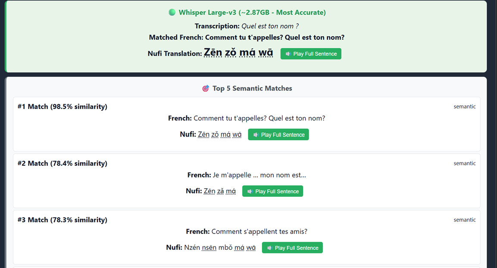

# AfricanVoice: AI-Powered Multilingual Voice Translator


## 🚀 Project Overview

**AfricanVoice** is a sophisticated AI-driven translation application designed to bridge the linguistic gap between **French, English, and Spanish** and **Nufi** (a Bamileke language from Cameroon). Unlike traditional dictionary lookups, this project leverages state-of-the-art **Machine Learning** and **Natural Language Processing (NLP)** techniques to understand spoken language and retrieve semantically similar translations, even when the phrasing differs from the database.

This project serves as a demonstration of applying modern AI to low-resource language preservation and education.

## 🌐 Live Demo

Try the live version of AfricanVoice deployed on Azure:  
**[https://african-text-to-speech-ehajh7daazdfhzft.canadacentral-01.azurewebsites.net/](https://african-text-to-speech-ehajh7daazdfhzft.canadacentral-01.azurewebsites.net/)**

<p align="center">
   
   
</p>

_Figure: Top — main UI (record & results). Bottom — semantic matches and Nufi playback._

No installation required - just click the link and start speaking!

## 🧠 Key AI & Machine Learning Features

### 1. Advanced Speech Recognition (ASR)
- **Engine:** [OpenAI Whisper](https://github.com/openai/whisper) (Large-v3 model).
- **Capability:** Transcribes spoken French, English, and Spanish with high accuracy, handling accents and background noise effectively.
- **Multi-Model Architecture:** Includes a development mode to compare performance across Whisper `Small`, `Medium`, and `Large-v3` models in real-time.

### 2. Semantic Search & Vector Embeddings
- **Embeddings:** Uses `SentenceTransformers` (`paraphrase-multilingual-MiniLM-L12-v2`) to convert text (French, English, Spanish) into high-dimensional vector representations.
- **Vector Database:** Implements **FAISS (Facebook AI Similarity Search)** for ultra-fast similarity retrieval.
- **Benefit:** Allows the system to understand *meaning* rather than just keywords.
    - *Input:* "Je me sens bien" (I feel good in French)
    - *Match:* "Je suis à l'aise" (I am at ease) -> **90.5% Similarity**
    - *Input:* "I feel good" (English)
    - *Match:* "Je suis à l'aise" (I am at ease) -> **High Similarity**

### 3. Hybrid Search Algorithm
To ensure the highest relevance, the system employs a tiered search strategy:
1.  **Exact Match:** Instant retrieval for identical phrases.
2.  **Token/Multi-word Match:** Heuristic matching for partial phrases.
3.  **Semantic Fallback:** Vector-based search for paraphrases and conceptual matches.

### 4. Smart Audio Processing
- **Silence Detection:** Real-time analysis of microphone input stream to detect speech onset and offset.
- **Auto-Stop:** Automatically stops recording after user-configurable silence duration (1-10 seconds).
- **Continuous Listening:** Advanced mode that segments speech after silence and processes multiple utterances sequentially.
- **Countdown Timer:** Visual countdown showing when the next processing will occur.
- **Queue System:** Handles multiple speech segments in continuous mode without interruption.

## 🛠️ Tech Stack

### Backend
- **Framework:** Flask (Python)
- **Data Processing:** Pandas, NumPy
- **Audio Processing:** `soundfile`, `librosa`

### AI & ML Libraries
- `openai-whisper` (Speech-to-Text)
- `sentence-transformers` (Embeddings)
- `faiss-cpu` (Vector Indexing)
- `torch` (PyTorch backend)

### Frontend
- **Core:** HTML5, CSS3, JavaScript (ES6+)
- **Audio:** Web Audio API (Real-time visualization and silence detection)
- **Templating:** Jinja2
- **User Controls:** Adjustable silence duration slider (1-10 seconds), language selection, drag-and-drop file upload
- **Continuous Mode:** Real-time countdown timer, queue management for multiple utterances

### Infrastructure & Data
- **Storage:** Azure Blob Storage (for hosting audio assets)
- **Containerization:** Docker & Docker Compose support
- **Data Source:** Custom curated CSV dataset mapping French phrases to Nufi translations and audio IDs.

## 📂 Project Structure

```
AfricanVoice/
├── app.py                 # Main Flask application & Search Logic
├── requirements.txt       # Python dependencies
├── Dockerfile             # Container configuration
├── assets/                # Data resources
│   ├── Nufi_Francais...csv # Raw dataset
│   ├── faiss_index.bin    # Pre-computed vector index
│   └── index_mapping.pkl  # Index-to-Dataframe mapping
├── templates/
│   └── index.html         # Responsive Frontend UI
├── tests/
│   └── build_index.py     # Script to generate FAISS index
└── audio/                 # Local audio cache (optional)
```

## ⚡ Quick Start

1. **Clone the repository:**
   ```bash
   git clone https://github.com/tchamna/african-text-to-speech.git
   cd AfricanVoice
   ```

2. **Create a virtual environment:**
   ```bash
   python -m venv .venv
   # Windows
   .\.venv\Scripts\Activate
   # Linux/Mac
   source .venv/bin/activate
   ```

3. **Install dependencies:**
   ```bash
   pip install -r requirements.txt
   ```

4. **Build the Vector Index (First run only):**
   ```bash
   python tests/build_index.py
   ```

5. **Run the application:**
   ```bash
   # Production mode (Semantic Search enabled)
   $env:APP_MODE='production'; python app.py
   ```

6. **Access the UI:**
   Open `http://127.0.0.1:5001` in your browser.

## 🎙️ Usage Guide

### Basic Recording
1. Click "🎤 Start Recording"
2. Wait for "Listening..." status
3. Speak clearly in French, English, or Spanish
4. The system will automatically detect silence and process your speech
5. Results appear with transcription, translation, and audio playback

### Advanced Features
- **Adjustable Silence Duration:** Use the slider to set how long to wait after speech before processing (1-10 seconds)
- **Continuous Listening:** The app automatically keeps listening for multiple utterances
- **Countdown Timer:** Shows "Processing in X.Ys" to indicate when the next segment will be processed
- **Language Selection:** Choose your input language for better transcription accuracy
- **File Upload:** Drag and drop audio files for batch processing

### Tips for Best Results
- Speak clearly and at normal volume
- Adjust silence duration based on your speaking pace (faster speakers may prefer shorter durations)
- Allow microphone access when prompted
- For continuous conversations, the system will process each pause automatically

## 🔮 Future Improvements
- Fine-tuning Whisper on African accented French.
- Expanding the dataset to include more Bamileke dialects.
- Implementing a feedback loop for users to correct translations.

## 📄 License
MIT License

## ☁️ Azure App Service: Deployment recommendations

When deploying to Azure App Service (Linux containers), large ASR models (e.g. Whisper `large-v3`) can cause startup OOMs or container termination if the host has constrained memory or multiple worker processes are started. Follow these conservative recommendations to keep the app stable in App Service:

- Recommended App Settings (add these as Web App settings / environment variables):
   - `APP_MODE=production`
   - `WHISPER_MODEL_SIZE=small` (or `medium` if your plan has >=4GB memory)
   - `WHISPER_LOAD_EXTRA_MODELS=0` (do not load extra models in App Service)
   - `WHISPER_FALLBACK_MODEL=small` (fallback if primary fails to load)

- Gunicorn / process recommendations (if you run with Gunicorn inside the container):
   - Use a single worker to avoid multiple copies of the model in memory:
      - `workers = 1`
      - `timeout = 120`
   - Example `gunicorn.conf.py` is provided in the repo (`gunicorn.conf.py`) with conservative defaults.

- Azure CLI quick command (example):
   ```powershell
   az webapp config appsettings set --resource-group <RESOURCE_GROUP> --name <APP_NAME> --settings APP_MODE=production WHISPER_MODEL_SIZE=small WHISPER_LOAD_EXTRA_MODELS=0 WHISPER_FALLBACK_MODEL=small
   ```

If you need higher accuracy from `large-v3` in production, consider using a managed transcription API (OpenAI or Azure Speech-to-Text) rather than hosting a very large model in App Service. I can help add a toggle to use remote ASR when `USE_REMOTE_ASR=1`.
